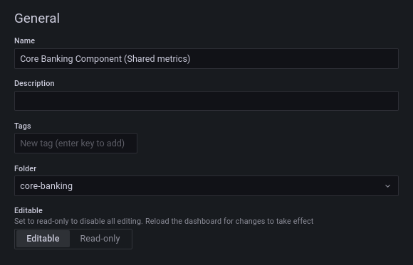

### grafana migration
<style type="text/css">
  .reveal h3, .reveal p, .reveal h4 {
    text-transform: none;
    text-align: left;
  }
  .reveal ul {
    display: block;
  }
  .reveal ol {
    display: block;
  }
  .reveal {
    background: #353535 !important;
  }
  .green {
      color: #00ff00;
  }
</style>

<small>`gitops-monitoring` ➝ [`kube-prometheus-stack`](https://github.com/prometheus-community/helm-charts/tree/main/charts/kube-prometheus-stack) chart</small>

<p class="fragment">scaling prometheus with thanos</p>
<p class="fragment">=> Standardised Cluster Dashboards</p>
<p class="fragment">=> Grafana being migrated</p>
<p class="fragment">=> Managed Dashboards</p>


NOTES:
- crucial time, we are migrating our kubernetes o11y stack (part of scalability w/thanos)
- prom/grafana/alertmanager/metric scraping components/hpa integrations/thanos all managed together in one chart (bundling KPS)
- small invis improv: less divergence between envirionments, less implicit coupling, less yaml maintain, free upgrades from community helm charts
- free community dashboards (thanks to standardised metrics and labels)
- but of course grafana also migrates
- this setup requires managed dashboards, so we are taking advantage of this to solve two problems

---
### Grafana Current


- [grafana.truelayer-sandbox.com](https://grafana.truelayer-sandbox.com)
- [grafana.t7r.dev](https://grafana.t7r.dev)
- [grafana.truelayer.com](https://grafana.truelayer.com)

NOTES:
- one per environment, isolation, up to date (so that's good)
- dashboards; no consistency 34 sandbox, 83 dev, 75 prod
- no sense of what's canonical, no backups of prod dashboards

---
### Grafana New

- [grafana-new.truelayer-sandbox.com](https://grafana-new.truelayer-sandbox.com)
- [grafana-new.t7r.dev](https://grafana-new.t7r.dev)
- [grafana-new.truelayer.com](https://grafana-new.truelayer.com)

NOTES:
- same dashboards in every environment (taken from prod, by popular demand)
- all dashboard ids stay the same, new prefix goes away, all urls should be the same after
- should not be a visibile migration
- scraping has not changed, so same data available, but it goes through thanos
- but the problem here is of course how can we edit dashboards, if they all use the same ones?
- this is really where we have a new big nono

---

<!-- .slide: data-background-image="./nonono.gif" data-background-size="100% auto" class="color"-->

NOTES:
- you cannot save dashboards on the grafana interface
- for some reason i've been hearing this audio clip constantly (of bitconnect guy's charismatic mm mm nonono), so eh, enjoy your 2017 meme

---

<!-- .slide: data-background-image="./provisioning_cannot_save_dashboard.png" data-background-size="50% auto" class="color"-->

NOTES:
- but by this popup
- so that sucks, and there is an extra step here now (even tho i distracted you with memes)
- Copy the JSON to Clipboard (either dialog, or in dashboard settings)
- goto `gitops-monitoring`


---

<!-- .slide: data-background-image="./configmap.png" data-background-size="50% auto" class="color"-->

NOTES:
- gitops-monitoring has a global dashboard folder with all dashboards
- they all look like this, they are k8s configmaps
- labels etc, there's this fancy generic sidecar that listens for changes to configmaps with a configurable label, and mounts the contents to fs, in the right subfolder
- not a grafana thing btw, grafana doesn't listen for cm changes, everyone can use such a sidecar
- and then we put these in every environment
- you might say, well that's a lot of cruft, and yeah, but you don't have to write it.

---
### Saving Dashboards

<small>With json model on clipboard:</small>

```sh
cd gitops-monitoring
./dashboard.sh payments # create dashboard file
make dashboards # update links
git add dashboards */dashboards
git commit -am "Update payments dashboard"
```

<small class="fragment">requires: [jq](https://stedolan.github.io/jq/download/), [python-yq](https://kislyuk.github.io/yq/)</small>

NOTES:
- first script reads your clipboard, wraps it in a configmap and puts it into the right folder
- second one refreshes all dashboards in development/sandbox/production subfolders (they symlink to this dashboards folder)
- that's the flow. hopefully not too bad
- does require jq/yq tools to massage json/yaml on CL. if working with k8s, you might already have them, otherwise get them, great, compatible apis
- does have to be in gitops-monitoring monitoring only cm ATM (trying to evolve this)


---
<!-- .slide: data-background-image="./configmap.png" data-background-size="50% auto" class="color"-->

NOTES:
- filenames need to be unique (within a grafana_folder)
- no need to think about it with our script
- result you should expect (in a diff)

---
<!-- .slide: data-background-image="./configmap-minified.png" data-background-size="90% auto" class="color"-->

NOTES:
- however you might the this unreadable mess (250k char scrollbar)
- happens if you have extremely large dashboards
- that's to get our largest dashboards accepted, there's a kubernetes hard limit on the size of configmaps 1MB, and annotation fields of 260k characters
- so if it looks like this, you are close to the limit, just FYI

---
### Migration

We sync prod dashboards to gitops-monitoring

<small class="fragment">One final time.</small>

NOTES:
- we sync. we have been doing this for a few weeks already.
- any changes you make to prod grafana will make it into this repo.
- no need to edit/import to git yet, but once we do our final sync, then it's all github

---
### When!?

<p class="fragment">SOMETIME NEXT WEEK</p>
<small class="fragment"><a>grafana.t7r.dev</a> / <a>grafana.truelayer.com</a> / <a>grafana.truelayer-sandbox.com</a></small>

<small class="fragment"><a>#engineering</a> notice to come</small>

NOTES:
- really close, next week, save for any unforseen delays
- some point swap urls, takes over the urls you know
- currently you have to prefix with -new
- once we give final confirmation (fragment)
- old grafana stops being canonical, and everything will look the same, and point to new

---
### Subtle Points: Editing

- `"editable": false` (not required)
- removes intrusive save changes popup
- removes `Panel -> Edit` button



NOTES:
- small things you can do; turn off `editable`
- not req, because as i just said; you cannot save on new grafana (popup)
- but will avoid the popup asking you to save, everytime you change a tabs visibility
- has the downside of removing the panel edit, so slightly more difficult if you want to see what query a panel runs
- can't mandate this, if you feel db is super mature and you know what it's visualising, feel free to turn it off, it's only 3 clicks for users to turn it on

---
### Subtle Points: Collaboration

<small class="fragment"><a>grafana-scratch.t7r.dev</a><br><a>grafana-scratch.truelayer.com</a><br> <a>grafana-scratch.truelayer-sandbox.com</a></small>

<small class="fragment">NO NEED TO GO HERE</small>

NOTES:
- old grafana will be renamed to this
- this is to collaborate on dashboards
- NO NEED TO USE; CAN EDIT ON NEW GRAFANA JUST NOT SAVE, COPY AFTER
- these will likely be periodically wiped, so please don't try use this just to avoid git
- tell us problems with the new flow


---
### Subtle Points: Cloudwatch

- cloudwatch datasource
- cloudwatch dev/prod hardcode

NOTES:
- only outstanding issues that we will fix before going live
- cloudwatch metrics missing (that's the blocker)
- cannot re-use these dashboards, coz they hardcode db names
- so either we parametrise the db names, or special case them
- there's like 6 of them

---
### Cloudwatch dashboards

- analytics/athena-usage.yaml
- connectivity/provider-registry-metrics.yaml
- connectivity/secret-service-metrics.yaml
- core/auth-server.yaml
- data-api/async-qman.yaml
- devops/aws-rds.yaml

NOTES:
- if you own one of these 6 dashboards, it might happen to you
- feel free to reach out

---
### TL;DW Grafana Dashboard Gitops

<small>With json model on clipboard:</small>

```sh
cd gitops-monitoring
./dashboard.sh payments # create dashboard file
make dashboards # update links
git add dashboards */dashboards
git commit -am "Update payments dashboard"
```

NEXT WEEK

NOTES:
- tldw, what you need next week after our notice in engineering
- that's it. thank for listening to this.
- i have two slides of potential future steps
- but ill look at questions now

---
Future steps

- declarative dashboards?
- dashboards generated along with alerts?
<small class="fragment">See [How we are dealing with metrics at scale on gitlab.com](https://www.youtube.com/watch?v=6sfr2IGJQXk)</small>

NOTES:
- grafanalib / grafonnet (what KPS uses, jsonnet, learning curve) / polly
- ensures dashboards and alerts are sync'd (future dashboard lifecycle problem)
- gitlab had a great talk on this

---

<!-- .slide: data-background-image="./polly.png" data-background-size="60% auto" class="color"-->

NOTES:
- polly via scuemata, grafanas schemas announced grafanacon last week
- (parametrised o11y config)
- https://pollypkg.github.io/polly/basics.html
- by guy who wrote `dep` for golang
